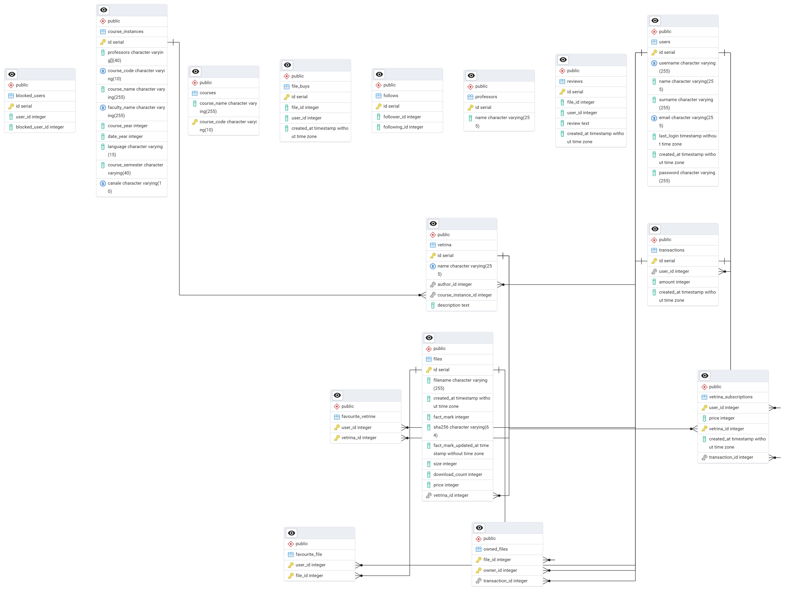

## Database Schema


## Setup

1. Clone the repository
2. Create a `.env` file with your database credentials:
   ```
   DB_NAME=postgres
   DB_USER=postgres
   DB_PASSWORD=your_password
   ```
3. Run `pip install -r requirements.txt` to install the dependencies
4. Run `python setup_database.py` to create the database tables
5. Run `python app.py` to start the Flask server

## Features

- Scrapes course information from Luiss portal
- Stores data in PostgreSQL database
- Provides a simple Flask API to access the data

